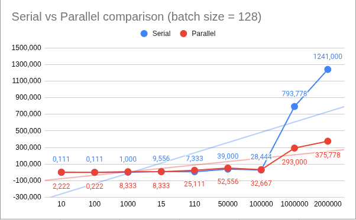

# L1. Определение достижимости параллелизма и реализация параллельных алгоритмов.

# Условие задачи

**Шаги выполнения:**

1. Выберите один из алгоритмов обхода графа (BFS или BFS).
2. Разберитесь с выбранным алгоритмом и выделите основные этапы его выполнения. Идентифицируйте зависимости между этапами и выберите те, которые можно эффективно распараллелить (для этого постройте граф зависимостей (можно в голове))
3. Напишите программу на выбранном вами языке программирования (java, c++), реализующую выбранный алгоритм с учётом параллельных возможностей.
4. С помощью инструментов (ThreadSanitizer && Helgrind для С++, JCStress тесты для Java) проанализировать программу на предмет отсутствия ошибок синхронизации данных. Если ошибок не нашлось, то внести их и найти.
5. Эксперименты и анализ результатов: 
    
    Проведите эксперименты, измеряя производительность параллельной реализации алгоритма на различных объемах входных данных. Сравните результаты с последовательной версией и опишите полученные выводы.
    

- Постройте график зависимости времени выполнения параллельной версий алгоритма от выделенных ресурсов.
- Постройте график зависимости времени выполнения параллельной и последовательной версий алгоритма в зависимости от объема входных данных.**Загрузить графики в отдельную директорию в репозиторииДля построения графиков можно воспользоваться чем угодно**

# Результаты и графики

## **Параллелизм на виртуальных потоках**

| **Mean** | **Serial** | **Parallel** |
| --- | --- | --- |
| **10** | 0,111 | 2,222 |
| **100** | 0,111 | 0,222 |
| **1000** | 1,000 | 8,333 |
| **15** | 9,556 | 8,333 |
| **110** | 7,333 | 25,111 |
| **50000** | 39,000 | 52,556 |
| **100000** | 28,444 | 32,667 |
| **1000000** | 793,778 | 293,000 |
| **2000000** | 1241,000 | 375,778 |

## **Параллелизм на 12-ти фиксированных потоках**

| **Mean** | **Serial** | **Parallel** |
| --- | --- | --- |
| **10** | 0,000 | 2,222 |
| **100** | 0,000 | 0,889 |
| **1000** | 2,222 | 6,333 |
| **15** | 14,000 | 14,111 |
| **110** | 8,889 | 29,667 |
| **50000** | 47,444 | 58,333 |
| **100000** | 34,333 | 15,000 |
| **1000000** | 888,444 | 214,556 |
| **2000000** | 1302,556 | 289,778 |

## **Параллелизм на 6-ти фиксированных потоках**

| **Mean** | **Serial** | **Parallel** |
| --- | --- | --- |
| **10** | 0,111 | 1,778 |
| **100** | 0,222 | 0,333 |
| **1000** | 2,222 | 4,778 |
| **15** | 14,000 | 11,667 |
| **110** | 9,111 | 26,333 |
| **50000** | 47,333 | 57,889 |
| **100000** | 29,222 | 12,778 |
| **1000000** | 822,000 | 204,444 |
| **2000000** | 1119,778 | 281,000 |

# Анализ результатов

- На маленьких графах линейная программа работает лучше, что очевидно, так параллельные программы имеют оверхэд, который только мешает при такой мелкой работе.
- В методе с виртуальными потоками создаётся по таске на отдельный набор вершин, а так как таких наборов может быть достаточно много, то мы рискуем тратить наше процессорное время не на полезную работу, а на переключение потоков, аллокации, синхронизации и так далее
- В методе с фиксированными потоками мы раздаем работу динамически, а не за раз, при том количество воркеров всегда фиксировано (6 или 12), работа CPU становится более предсказуемой и стабильной, так как независимо от того какой большой граф нам подадут процессор всегда будет работать с “одним и тем же” пуллом воркеров и планировать одну и ту же работу, отличаться будет лишь размер наборов вершин и глобальное количество вершин. Короче говоря - будет меньше оверхэдов при работе с фиксированными потоками
- 6 фиксированных потоков оказались лучше 12-ти, потому что - пускай мой процессор и поддерживать 12 потоков, но он, тем не менее, может упереться в кэши, память и их пропускные способности, более того, с увеличением потоков увеличивается и количество переключений, что тоже добавляет оверхэд. Также не стоит забывать, что при меньшем количестве потоков снижается конкуренция за доступ к общим ресурсам, например **`vertPointer`**, который указывает на вершину, которую надо обработать